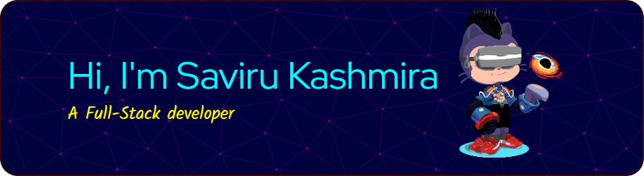

<div>
  
  
  
</div>

```Hi there, I'm Saviru Kashmira Atapattu. I'm a full-stack developer and also a software engineering student skills like full-stack development, programming, cloud computing and AI and machine learning etc. I do open-sources. Feel free to contact me. I may be slow to respond but I will surely respond you```

### My GitHub stats

<div align="center">
  
  
  
</div>

### Connect with me on,

<div align="center">
  <a href="https://www.linkedin.com/in/saviru-kashmira/" target="_blank">
    
  </a>
  <a href="https://www.youtube.com/@TECHVISIONLK" target="_blank">
    
  </a>
  <a href="https://www.instagram.com/Saviru.06/" target="_blank">
    
  </a>
  <a href="https://www.facebook.com/@saviru.06" target="_blank">
    
  </a>
  <a href="savirukashmira@gmail.com" target="_blank">
    
  </a>
  
  <a href="https://stackoverflow.com/users/18275957/saviru-kashmira" target="_blank">
    
  </a>
  <a href="https://dev.to/saviru" target="_blank">
    
  </a>
  <a href="patreon.com/SaviruKashmira" target="_blank">
    
  </a>
  <a href="https://learn.microsoft.com/en-us/users/savirukashmira-8630/" target="_blank">
    
  </a>
</div>


<h3 align="left">My tech stack</h3>
<p align="left">
<a href="https://www.microsoft.com/en-us/windows" target="_blank" rel="noreferrer">  </a>
<a href="https://jupyter.org" target="_blank" rel="noreferrer">  </a>
<a href="https://learn.microsoft.com/en-us/dotnet/csharp/" target="_blank" rel="noreferrer">  </a>
<a href="https://cplusplus.com" target="_blank" rel="noreferrer">  </a>
<a href="https://www.javascript.com" target="_blank" rel="noreferrer">  </a>
<a href="https://www.java.com" target="_blank" rel="noreferrer">  </a>
<a href="https://python.org" target="_blank" rel="noreferrer">  </a>
<a href="https://developer.android.com" target="_blank" rel="noreferrer">  </a> 
<a href="https://www.arduino.cc/" target="_blank" rel="noreferrer">  </a> <a href="https://aws.amazon.com" target="_blank" rel="noreferrer">  </a> <a href="https://azure.microsoft.com/en-in/" target="_blank" rel="noreferrer">  </a> <a href="https://www.gnu.org/software/bash/" target="_blank" rel="noreferrer">  </a> <a href="https://www.blender.org/" target="_blank" rel="noreferrer">  </a> <a href="https://getbootstrap.com" target="_blank" rel="noreferrer">  </a> <a href="https://www.w3schools.com/css/" target="_blank" rel="noreferrer">  </a> <a href="https://www.djangoproject.com/" target="_blank" rel="noreferrer">  </a> <a href="https://www.docker.com/" target="_blank" rel="noreferrer">  </a> <a href="https://dotnet.microsoft.com/" target="_blank" rel="noreferrer">  </a> <a href="https://www.figma.com/" target="_blank" rel="noreferrer">  </a> <a href="https://firebase.google.com/" target="_blank" rel="noreferrer">  </a> <a href="https://flask.palletsprojects.com/" target="_blank" rel="noreferrer">  </a> <a href="https://flutter.dev" target="_blank" rel="noreferrer">  </a> <a href="https://cloud.google.com" target="_blank" rel="noreferrer">  </a> <a href="https://git-scm.com/" target="_blank" rel="noreferrer">  </a> <a href="https://heroku.com" target="_blank" rel="noreferrer">  </a> <a href="https://www.w3.org/html/" target="_blank" rel="noreferrer">  </a> <a href="https://www.adobe.com/in/products/illustrator.html" target="_blank" rel="noreferrer">  </a> <a href="https://kotlinlang.org" target="_blank" rel="noreferrer">  </a> <a href="https://www.linux.org/" target="_blank" rel="noreferrer">  </a> <a href="https://www.mongodb.com/" target="_blank" rel="noreferrer">  </a> <a href="https://www.mysql.com/" target="_blank" rel="noreferrer">  </a> <a href="https://nextjs.org/" target="_blank" rel="noreferrer">  </a> <a href="https://www.nginx.com" target="_blank" rel="noreferrer">  </a> <a href="https://nodejs.org" target="_blank" rel="noreferrer">  </a> <a href="https://opencv.org/" target="_blank" rel="noreferrer">  </a> <a href="https://www.oracle.com/" target="_blank" rel="noreferrer">  </a> <a href="https://www.photoshop.com/en" target="_blank" rel="noreferrer">  </a> <a href="https://pytorch.org/" target="_blank" rel="noreferrer">  </a> <a href="https://www.qt.io/" target="_blank" rel="noreferrer">  </a> <a href="https://reactjs.org/" target="_blank" rel="noreferrer">  </a> <a href="https://reactnative.dev/" target="_blank" rel="noreferrer">  </a> <a href="https://www.sketch.com/" target="_blank" rel="noreferrer">  </a> <a href="https://tailwindcss.com/" target="_blank" rel="noreferrer">  </a> <a href="https://www.tensorflow.org" target="_blank" rel="noreferrer">  </a> <a href="https://unity.com/" target="_blank" rel="noreferrer">  </a> <a href="https://unrealengine.com/" target="_blank" rel="noreferrer">  </a> <a href="https://vuejs.org/" target="_blank" rel="noreferrer">  </a> <a href="https://www.adobe.com/products/xd.html" target="_blank" rel="noreferrer">  </a> </p>

###

<div>
  <br><br>
  <picture>
    <source media="(prefers-color-scheme: dark)" srcset="https://octodex.github.com/images/godotocat.png" style="border-radius: 20px;" align="right" width=250 height=250>
    
  </picture>

  <br>
  <p>Thank you for visiting my GitHub profile ! Feel free to contact me. Also don't forget to visit <a href="saviru.github.io"><b><u>my personal website</u></b></a>.</p>
</div>


###