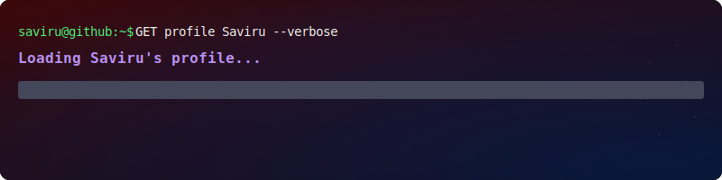

<a href="http://gitbanner.Saviru.me/" target="_blank"></a>

```Hi there, I'm Saviru Kashmira Atapattu. I'm a full-stack developer and also a undergraduate student in SLIIT hoping to specialize in software engineering with skills like full-stack development, programming, cloud computing and AI and machine learning etc. I do open-sources. Feel free to contact me. I may be slow to respond but I will surely respond you```

<br>

## My GitHub Stats

<div align="center">  
  
  
  
  
  <br>
  
</div>

<br>

## My GitRoll Stats

<a href="https://gitroll.io/profile/u7pe5k1ya0IcTBsvJEpeh2LTVpK42" target="_blank"></a>

<br>

## Let's have a fun ! 🎮

> #### Here are some **games/activities** you can play on my **Github**.
>
> - <a href="https://github.com/Saviru/tic-tac-toe.md/blob/main/Game.md#top">Tic-Tac-Toe (Game) 🔴❎</a>
> - <a href="https://github.com/Saviru/change-the-cat#top">Change the Cat (Fun activity) 😸</a>
> - <a href="#python-processing-my-pushes-">Python Processing My Pushes (Animation) 🐍</a>
> - Coming soon...

<br>


## 🤝 Connect with Me

<p align="center">
  <a href="https://www.linkedin.com/in/saviru-kashmira/" target="_blank">
    
  </a>
  <a href="https://www.instagram.com/savii.2k06/" target="_blank">
    
  </a>
  <a href="https://www.facebook.com/saviru.06" target="_blank">
    
  </a>
</p>

<p align="center">
  <a href="mailto:savirukashmira@gmail.com">
    
  </a>
  <a href="https://stackoverflow.com/users/18275957/saviru-kashmira" target="_blank">
    
  </a>
  <a href="https://dev.to/saviru" target="_blank">
    
  </a>
</p>

<p align="center">
  <a href="https://www.patreon.com/SaviruKashmira" target="_blank">
    
  </a>
  <a href="https://learn.microsoft.com/en-us/users/saviru" target="_blank">
    
  </a>
  
</p>

<br>

## My Tech Stack

| Category | Technologies |
| :--- | :--- |
| **Languages & Web** |               |
| **Frontend & App Dev** |             |
| **Backend & Databases** |         |
| **Data & Machine Learning** |     |
| **Cloud & Hosting** |        |
| **Tools & Infrastructure** |        |

<br>

<br>

## Support My Journey

<a href="https://www.buymeacoffee.com/saviru.06"></a>

<br><br>
<a name="snake"></a>

## Python Processing My Pushes 🐍

[](https://github.com/Saviru/contribution_snake)


<hr>

<div>
  <br><br>
  <picture>
    
  </picture>

  <br>
  <p>Thank you for visiting my GitHub profile ! Feel free to contact me. Also don't forget to visit <a href="https://saviru.me"><b><u>my personal website</u></b></a>.</p>
  
</div>
<br>
<br>
<hr>
<p align="center">❤️ from Saviru Kashmira Atapattu</p> 
